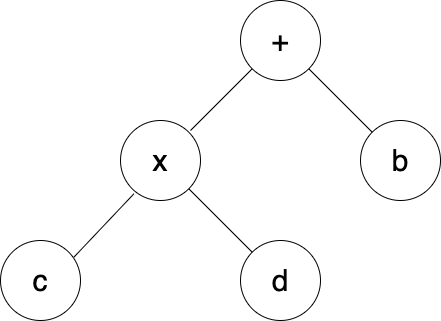

# Sparse Execution Engine
Executes a given expression in sparse manner. 

Addition and multiplication operators are supported.

Operands are defined as STL Map data structure. Keys are in the format of std::pair<int,int> and values are double.

Expression is defined in the binary tree format. 

For example, for the expression a = b + c * d, expression tree looks like below

In C++ code this tree can be expressed as follows

    node *root = new node("+");
    root->left = new node("*");
    root->left->left = new node(c);
    root->left->right = new node(d);
    root->right = new node(b);

## Build 
Run following commands from main folder

### Build using CMake

    mkdir build 
    cd build
    cmake -DCMAKE_BUILD_TYPE=Release ..
    make

### Build using g++

    mkdir build
    g++ --std=c++11 src/main.cc -o build/sparse_execution_engine

## Run

    ./build/sparse_execution_engine
